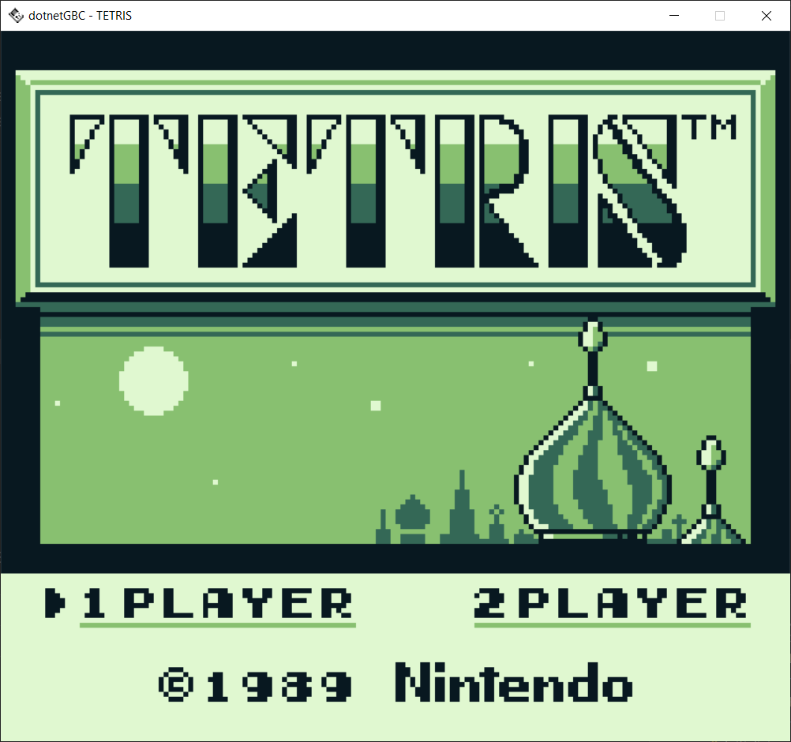
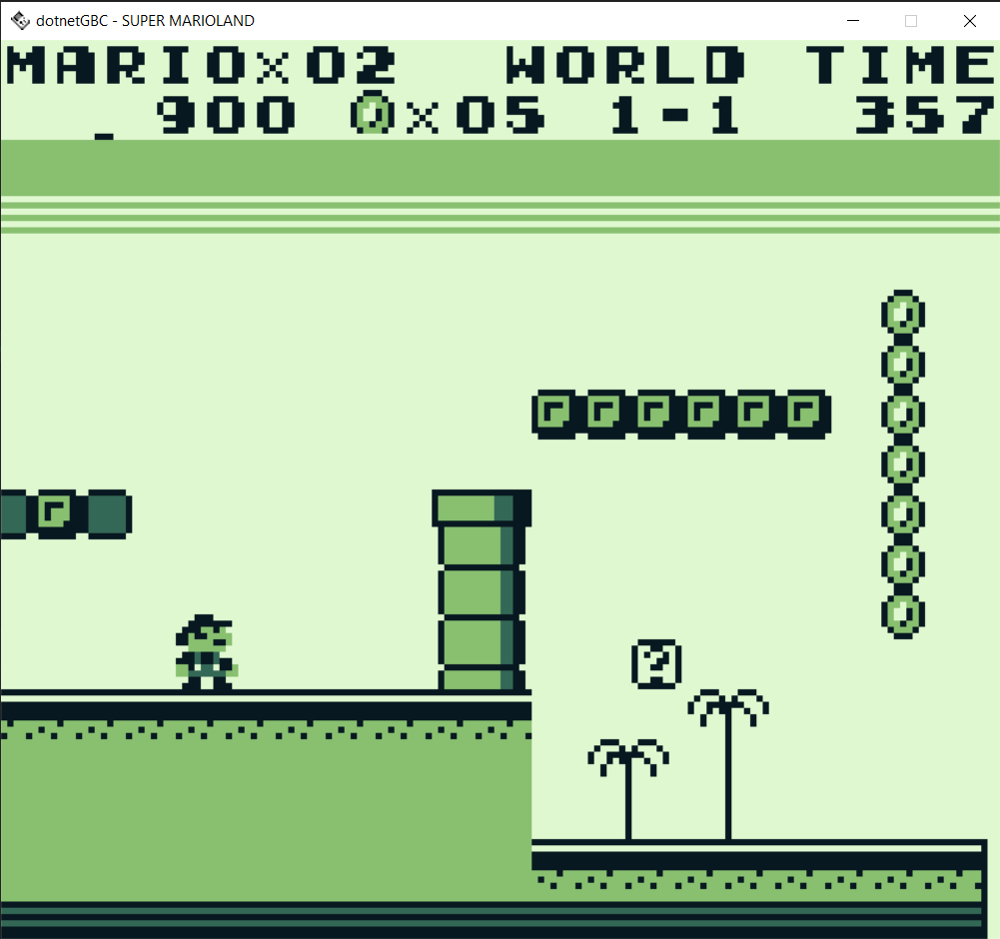
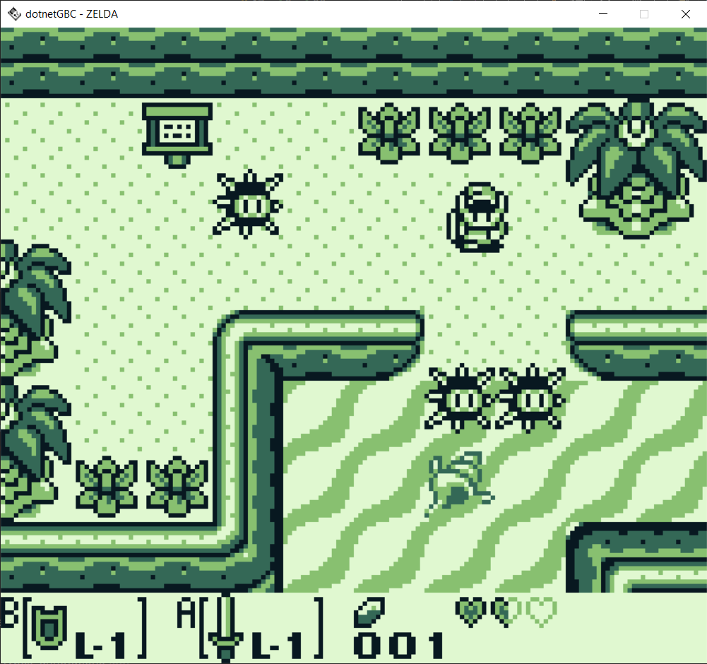

This is a WIP Game Boy / Game Boy Color emulator written in C# with SDL2 for Windows 10/11.
This was/is a learning and personal development project, and thus will not target a full-featured release.
I'm fairly happy with the results of this project, as it was my first attempt at any kind of emulation and the Game Boy is a non-trivial piece of hardware.

Game Boy functionality is mostly complete.  Cartridges with no memory mapper or either MBC1 and MBC2 are likely to be fully functional.  Initial implementations for MBC3 and MBC5 have been completed, but do not yet pass testing.

Sound is working, although may desync over time with some games.  YMMV.

Default controls are set up via SDL2's input system and currently assume the presence of an Xinput gamepad.  There is a basic control rebinding system in place, but there is no GUI available for it at this time.

Current Blargg ROM test results are listed in the tests_status.ods spreadsheet.

Game Boy Color graphical rendering is not currently functional, but GBC roms do load and run.  If I pick this project back up again, this will be the first thing I try to fix, as I expect a fresh set of eyes would be able to find this issue quickly.

The primary resources used were:

The Game Boy Pandocs - https://gbdev.io/pandocs/
 
gbops (Opcode table) - https://izik1.github.io/gbops/

Various Game Boy test roms can be found here: https://github.com/c-sp/game-boy-test-roms

(I primarily focused on the Blargg roms (https://github.com/retrio/gb-test-roms)

